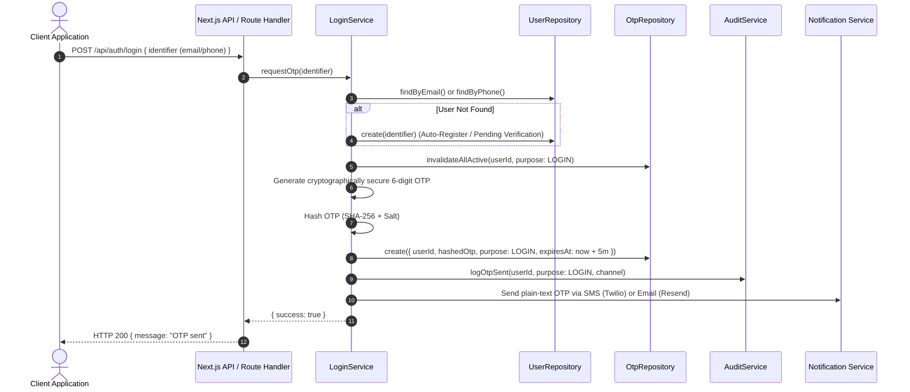
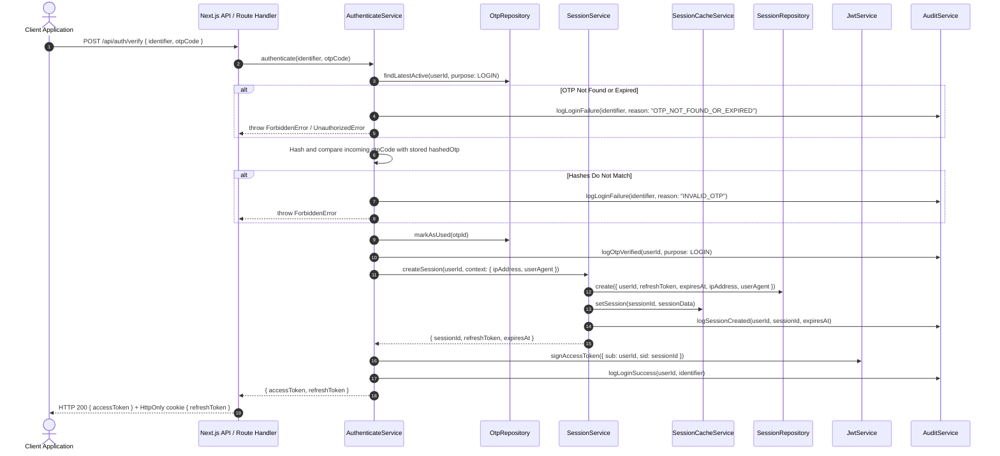
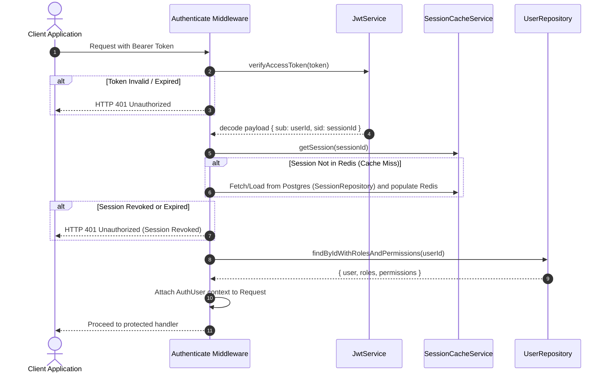

# Identity & Access Management: Authentication Flow

This document details the end-to-end authentication lifecycle of the Blue Pineapple platform, starting from a user requesting an OTP to issuing stateful JWT sessions.

## 1. OTP Login Request Flow
The login process begins when a user submits their unique identifier (email or phone number).

---

## 2. OTP Verification & Session Issuance Flow
Once the OTP is received, the client submits it for verification. Verification instantly creates a stateful session.

---

## 3. Stateful Access Token Verification Flow
For every subsequent request to protected resources, the client attaches the JWT access token in the `Authorization: Bearer <token>` header.

